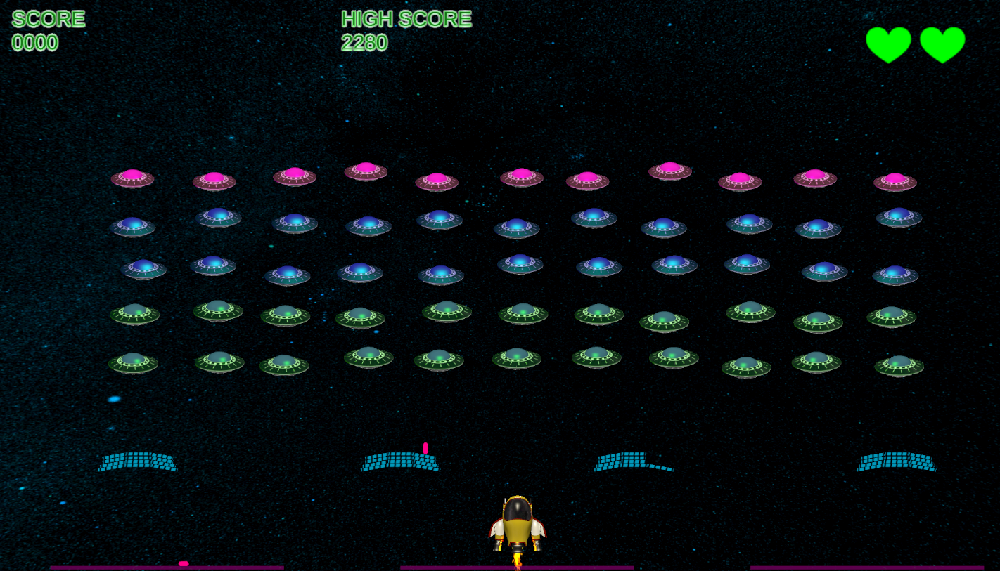

# 🚀 Space Invaders - Physics Edition

A classic arcade shooter reimagined with modern physics, dynamic interactions, and powerful new mechanics. Built with Unity.

### 🎮 [Play Online Now ](https://lobizhao.github.io/MiniGame-Space-Invaders/)

---

---

## ✨ Features 

This project enhances the traditional Space Invaders gameplay with three major innovative systems:

### 1. 🧱 Physics & Debris System 
The world is no longer static.
- **Dynamic Wreckage:** Destroyed invaders don't just vanish—they turn into burnt-out "dark matter" debris that physically falls to the ground.
- **Interaction:** The player's ship can push through piles of wreckage.
- **Gravity:** Missed bullets and debris react to gravity, piling up on the floor.

### 2. 🛡️ Umbrella Shield 
A defensive power-up triggered by destroying the **UFO**.
- **Ricochet Physics:** Deploys a physical mesh shield for 5 seconds that bounces enemy bullets away with a satisfying metallic sound.
- **Invulnerability:** Provides a brief window to play aggressively.

### 3. ⏳ Time Slow Mechanic 
Control the flow of battle by catching the rare **Clock** item.
- **Matrix Style:** Slows down the entire enemy matrix and projectiles to **10% speed**.
- **Tactical Advantage:** Gives you 5 seconds of precision movement to dodge impossible bullet patterns.

---

## 🛠️ Tech Stack
- **Engine:** Unity 2021+
- **Language:** C#
- **Platform:** WebGL (Desktop Browser)

---

## 🕹️ Controls
- **Arrow Keys / WASD:** Move Ship
- **Space:** Shoot
- **P:** Pause / Menu

---

*Enjoy the game! Feedback is welcome.*